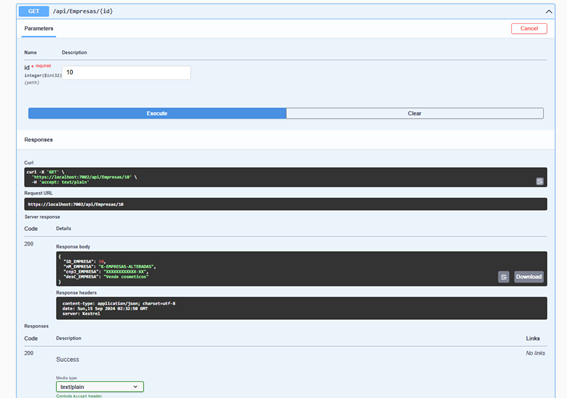

# Projeto BeautyTech

## Integrantes

- **CARLOS EDUARDO MENDONÇA DA SILVA** - RM552164
- **CARLOS ALBERTO MACHARELLI JUNIOR** – RM551677
- **EDUARDO TOSHIO ROCHA OKUBO** – RM551763
- **KAUÊ ALEXANDRE DE OLIVEIRA** – RM551812
- **VITOR MACHADO MIRANDA** – RM551451

## Arquitetura

Usei a **arquitetura monolítica**, onde todo o sistema é implantado em uma única aplicação, com todas as interfaces e funcionalidades interconectadas no projeto. Estou utilizando essa arquitetura porque, ao manter todo o sistema em uma única aplicação, ela facilita o desenvolvimento e o gerenciamento a curto prazo, permitindo que alterações ou correções sejam feitas de forma rápida. Além disso, essa abordagem tem um custo menor em termos de controle e gerenciamento da infraestrutura.

## Padrões Utilizados

- **Singleton Pattern**: Não está exatamente implícito no código, mas está sendo utilizado pelo Swagger e outros middlewares do ASP.NET Core, pois são serviços que utilizam uma única instância durante todo o ciclo de vida da aplicação.

- **Dependency Injection**: As dependências (por exemplo, `AppDbContext`) são injetadas nas classes em vez de serem instanciadas diretamente, promovendo maior flexibilidade e facilidade de manutenção.
## Instruções para Rodar a API:

### Passos para Execução

1. **Clone o repositório do github**:
2. **Banco de Dados**: Configure o banco de dados que será utilizado pela API e atualize a string de conexão no arquivo `appsettings.json`.
3. **Criar migrations**: Rode no cmd "dotnet ef migrations add InitialCreate".
4. **Banco de Dados**: Aplique as alterações no banco "dotnet ef database update".
5. **Projeto**: Rode o projeto.
6. **SWAGGER**: Voce ira acessar o Swagger em um caminho semelhante a esse https://localhost:5001/swagger.
7. **Teste*: Teste a API da Classe "Empresa", teste todo o CRUD.

### TESTES SWAGGER
- **POST**

- **GET/SELECT**
  

- **PUT/GET/SELECT**
  

- **DELETE/SELECT**
  

